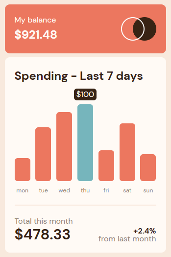

# Frontend Mentor - Expenses chart component solution

This is a solution to the [Expenses chart component challenge on Frontend Mentor](https://www.frontendmentor.io/challenges/expenses-chart-component-e7yJBUdjwt). Frontend Mentor challenges help you improve your coding skills by building realistic projects. 

## Table of contents

- [Overview](#overview)
  - [Screenshot](#screenshot)
  - [Links](#links)
- [My process](#my-process)
  - [Built with](#built-with)
  - [What I learned](#what-i-learned)
  - [Continued development](#continued-development)

## Overview

### Screenshot

### Links

- Solution URL: (https://github.com/drobotmaksym/Expenses-Card)
- Live Site URL: (https://www.frontendmentor.io/challenges/expenses-chart-component-e7yJBUdjwt)

## My process

### Built with

- Semantic HTML5 markup
- CSS custom properties
- Flexbox
- Mobile-first workflow

### What I learned

I have practiced using custom properties, utility classes as well as semantic HTML.
I learned to identify basic HTML elements and their hierarchy.
I learned that you should not view headings as a way to style elements, but rather to define proper page structure.

### Continued development

I would like to simplify the solution in the future. In addition, the card could be made responsive to different screen sizes. The main difficulty in the project was to implement the chart.
I am sure there was a much better solution.
